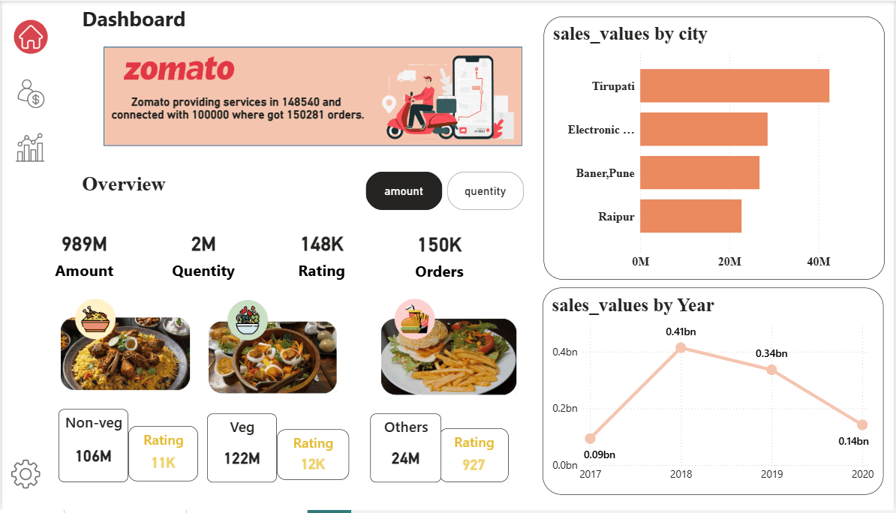
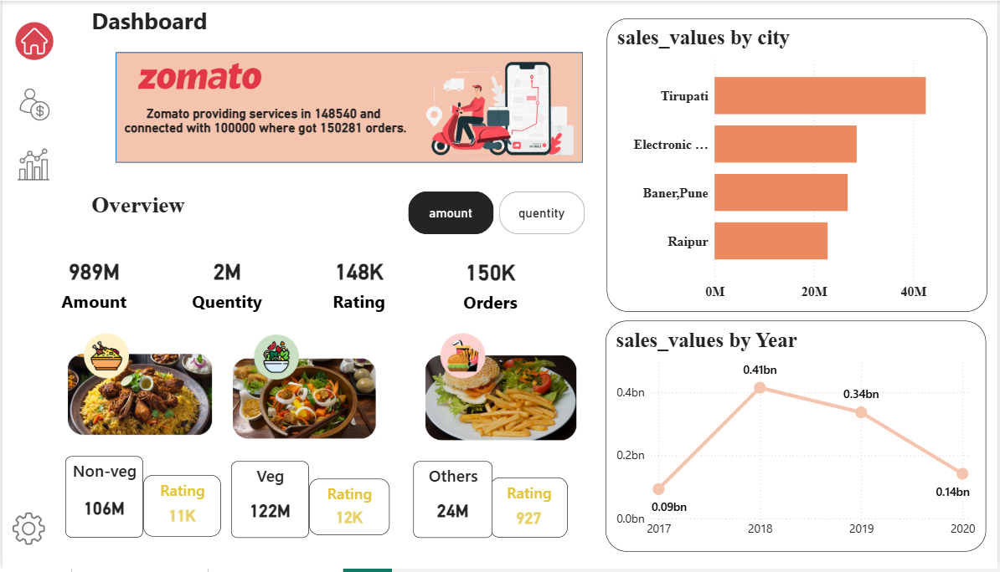
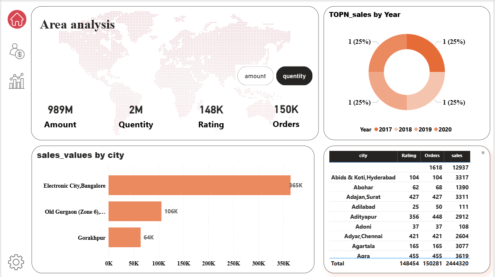
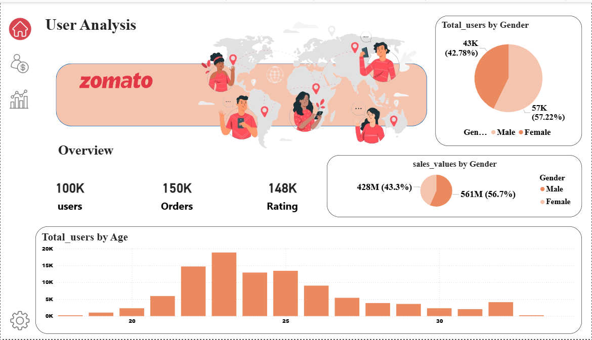

# 🍽️ Zomato Data Analytics Dashboard  

  
  
  
  

  

## 📌 Project Overview

This project presents a **Zomato Data Analytics Dashboard** built to analyze food delivery data across multiple dimensions such as:

* 📊 Sales Performance
* 🌍 Area Analysis
* 👤 User Insights
* 🍴 Food Category Trends

The dashboard provides **actionable insights** for business decision-making using **interactive visualizations** in Power BI.

---

## 🎯 Objectives

* Analyze **sales trends over time**
* Identify **top-performing cities & locations**
* Understand **customer behavior**
* Compare **food category performance (Veg / Non-Veg / Others)**
* Evaluate **user demographics**

---

## 🛠️ Tools & Technologies

* 📊 Power BI
* 📁 Data Cleaning & Transformation
* 📈 Data Visualization
* 🧠 Business Intelligence

---

## 📷 Dashboard Preview

### 🔹 Main Dashboard

  

---

## 🔍 **Overview:**
 - Complete business performance snapshot  
 - KPI cards, category insights, and trends  

## 📊 **Highlights:**
- 💰 Sales: 989M  
- 🧾 Orders: 150K  
- ⭐ Ratings: 148K  

---

### 🔹 Area Analysis

  

---

## 🔍 **Overview:**
- Focuses on geographic and city-level performance  

## 📊 **Highlights:**
- 🏆 Top City: Electronic City (Bangalore)  
- 📍 Strong metro performance  

---

### 🔹 User Analysis

  

---

## 🔍 **Overview:**
- Analyzes user demographics and behavior  

## 📊 **Highlights:**
- 👨 Male: 57%  
- 👩 Female: 43%  
- 🎯 Age Group: 22–26 dominant  

---

## 🎬 Animation (Optional - Recommended 🔥)

If you want animation, convert images into GIF and add below:

  

---

## 📊 Key Insights

### 📌 Overall Metrics

* 💰 Total Sales: **989M**
* 📦 Total Orders: **150K**
* ⭐ Ratings: **148K**
* 📊 Quantity Sold: **2M**

---

### 📌 Top Performing Cities

* 🥇 Tirupati
* 🥈 Bangalore
* 🥉 Pune

👉 These cities contribute the highest revenue.

---

### 📌 Yearly Sales Trend

* 📈 Peak in **2018 (0.41bn)**
* 📉 Decline after 2019

---

### 📌 Category Performance

| Category | Sales | Ratings |
| -------- | ----- | ------- |
| Non-Veg  | 106M  | 11K     |
| Veg      | 122M  | 12K     |
| Others   | 24M   | 927     |

👉 **Veg category performs best overall**

---

## 👤 User Insights

* 👥 Total Users: **100K**
* 👩 Female Users: **57.22%**
* 👨 Male Users: **42.78%**

👉 Female users dominate the platform.

---

## 📈 Age Distribution

* Majority users fall between **20–25 years**
* Younger audience is highly active

---

## 🧠 Business Recommendations

* Focus marketing on **top-performing cities**
* Improve performance in **low-sales areas**
* Target **young users (20–25 age group)**
* Expand **Veg category offerings**
* Address **post-2019 sales decline**

---

## 🌟 Future Improvements

* 🔄 Real-time data integration
* 🌐 Web deployment
* 🤖 Machine Learning predictions
* 🎨 UI/UX enhancements

---

## 👨‍💻 Author

**Tushar Vala**
📧 [tusharvala707@gmail.com](mailto:tusharvala707@gmail.com)

---

